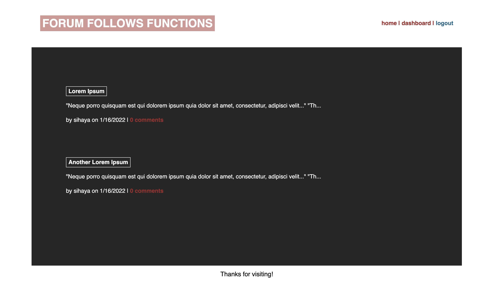
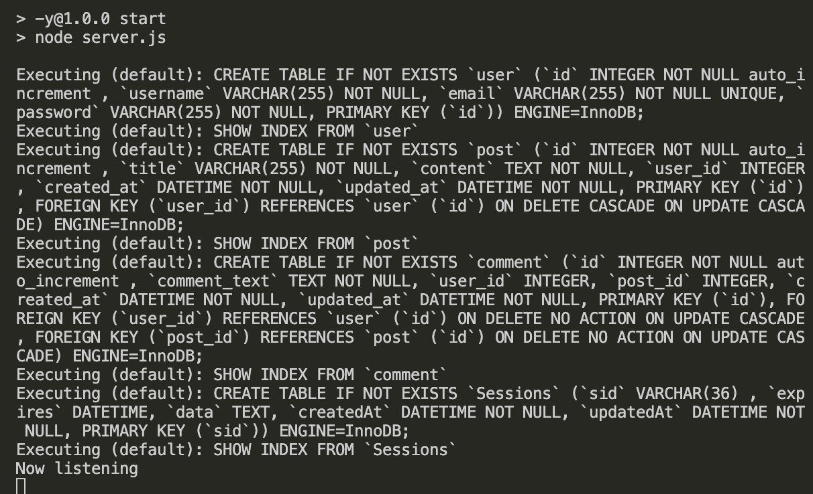
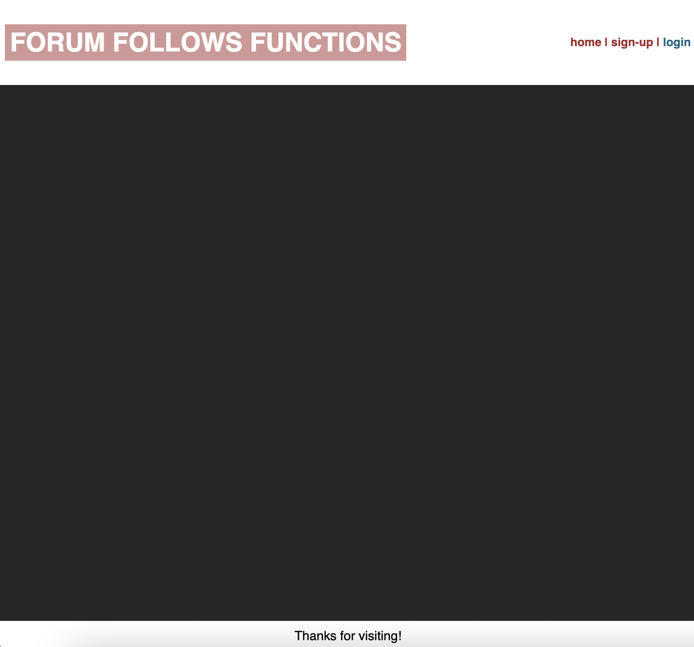
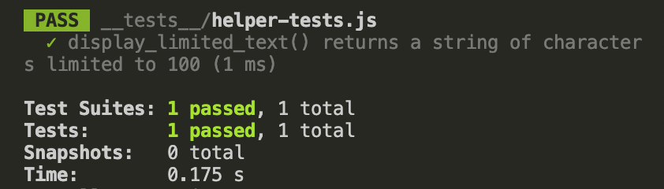

# Forum Follows Functions
  
  
   
  
                      
   

  ## TABLE OF CONTENTS

  

  [Description](#description) *
  [Prerequisites](#prerequisites)*
  [Installation](#installation) *
  [Usage](#usage) *
  [Tests](#tests) *
  [Questions](#questions) *
  [License](#license)

   

    
  
   

  ## Description

  This is a CMS style tech blog forum where users can create an account to make posts, and interact with the posts of other users. 

  MVC is implemented in this app for seperaton of concerns.

   
   
  Deployment: https://forum-follows-functions.herokuapp.com/
   
  Repo: https://github.com/sihayah/forum_follows_functions

 

  ## Prerequisites

  Make sure you have the following installed on your development machine:

  Git - [Download & Install Git](https://git-scm.com/downloads)
   
  Node.js - [Download & Install Node.js](https://nodejs.org/en/download/)
   
  Visual Studio Code - [Download & Install VS Code](https://code.visualstudio.com/download)
   
  MySQL - [Download & Install MySQL](https://coding-boot-camp.github.io/full-stack/mysql/mysql-installation-guide)

   

  ## Installation

  Clone the repo locally. Open of the repo in VS Code. Run npm install to install all dependencies via the command line...

    npm install
  
  In the root folder of the repo, create a .env file...

    touch .env
  
  Navigate to the .env file and add the following code, updated with your data...

    DB_NAME='form_follows_functions_db'
    DB_USER=(your MySQL username)
    DB_PW=(your MySQL password)

   

   

## Usage

  To demo this app navigate to https://forum-follows-functions.herokuapp.com/.

  To view locally, run npm start in the command line. 

    npm start

  If it's running the following response should occur in your command line...

    

  If you then navigate to http://localhost:3001, you should see the following:

   

  Sign-up and create a blog post. When you submit, the blog posts will populate below the post form in your dashboard. Then, if you navigate to the home page, you will see all of the posts that have been created and you can select a post to comment or upvote. 

  
   

  ## Tests

  To test the helper function that accepts a string limited to 100 characters or less, in command line run following code:

    npm run test

  The result should appear in the command line as follows:

  
  

   

  ## Questions

  

  For any further inquiries, please contact me via gitHub: [(sihayah)](https://github.com/sihayah) or email: sihayaharris@gmail.com

   

  

  ## License

  
  
  [click here for more information about ISC license.](https://opensource.org/licenses/ISC)
  

   
   
